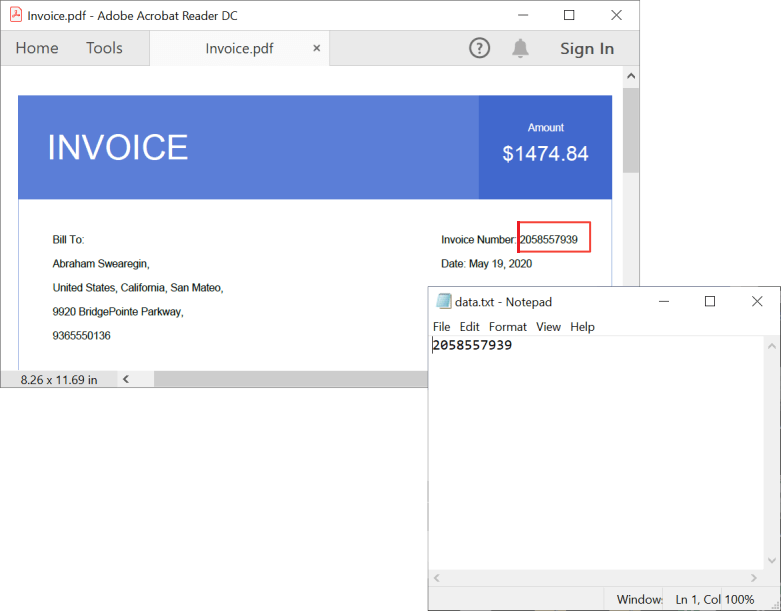

# How to Extract Text from a PDF Document in .NET using the PDF Library

## Introduction
A quick start .NET console project that shows how to extract text from a PDF document using the Syncfusion PDF Library.

## System requirement
**Framework and SDKs**
* .NET SDK (version 5.0 or later)

**IDEs**
*  Visual Studio 2019/ Visual Studio 2022

## Code snippet for Extract text from a specific page
We will create a new .NET console application, add the Syncfusion PDF library package, and write the code

```csharp
//Get stream from an existing PDF document. 
FileStream docStream = new FileStream("Input.pdf", FileMode.Open, FileAccess.Read);
//Load the PDF document. 
PdfLoadedDocument loadedDocument = new PdfLoadedDocument(docStream);
//Load the first page. 
PdfPageBase page = loadedDocument.Pages[0];
//Extract text from first page. 
string extractedText = page.ExtractText();
//Save the text.
File.WriteAllText("Result.txt", extractedText);
//Close the document.
loadedDocument.Close(true);
```

**Output Image**


## Code snippet for Layout-based text extraction
We will create a new .NET console application, add the Syncfusion PDF library package, and write the code

```csharp
//Get stream from an existing PDF document. 
FileStream docStream = new FileStream("Invoice.pdf", FileMode.Open, FileAccess.Read);
//Load the PDF document.
PdfLoadedDocument loadedDocument = new PdfLoadedDocument(docStream);
//Load first page.
PdfPageBase page = loadedDocument.Pages[0];
//Extract text from first page.
string extractedTexts = page.ExtractText(true);
//Save the text.
File.WriteAllText("data.txt", extractedTexts);
//Close the document.
loadedDocument.Close(true);
```

**Output Image**


## Code snippet for Extract text from the entire PDF document
We will create a new .NET console application, add the Syncfusion PDF library package, and write the code

```csharp
//Get stream from an existing PDF document.
 FileStream docStream = new FileStream("Data.pdf", FileMode.Open, FileAccess.Read);
//Load the PDF document.
PdfLoadedDocument loadedDocument = new PdfLoadedDocument(docStream);
string extractedText = string.Empty;
//Extract all the text from the PDF document pages.
foreach (PdfLoadedPage loadedPage in loadedDocument.Pages) {
    extractedText += loadedPage.ExtractText();
}
//Save the text to file.
File.WriteAllText("data.txt", extractedText);
//Close the document.
loadedDocument.Close(true);
```

**Output Image**


## Code snippet for Extract text from predefined bounds
We will create a new .NET console application, add the Syncfusion PDF library package, and write the code

```csharp
//Get stream from an existing PDF document. 
FileStream docStream = new FileStream("Invoice.pdf", FileMode.Open, FileAccess.Read);
//Load the PDF document.
PdfLoadedDocument loadedDocument = new PdfLoadedDocument(docStream);
//Get the first page of the loaded PDF document.
PdfPageBase page = loadedDocument.Pages[0];
//Create line collection. 
var lineCollection = new TextLineCollection();
//Extract text from the first page.
page.ExtractText(out lineCollection);
RectangleF textBounds = new RectangleF(474.96198f, 161.62997f, 50.040073f, 9);
string invoiceNumber = "";
//Get the text provided in the bounds.
foreach (TextLine textLine in lineCollection.TextLine) {
    foreach (TextWord word in textLine.WordCollection) {
        if (textBounds==word.Bounds) {
            invoiceNumber = word.Text;
            break;
        }
    }
}
//Save the text to file.
File.WriteAllText("data.txt", invoiceNumber);
//Close the PDF document. 
loadedDocument.Close(true);
```

**Output Image**


## How to run the examples
* Download this project to a location in your disk. 
* Open the solution file using Visual Studio. 
* Rebuild the solution to install the required NuGet package. 
* Run the application.

## Resources
*   **Product page:** [Syncfusion PDF Framework](https://www.syncfusion.com/document-processing/pdf-framework/net)
*   **Documentation page:** [Syncfusion .NET PDF library](https://help.syncfusion.com/file-formats/pdf/overview)
*   **Online demo:** [Syncfusion .NET PDF library - Online demos](https://ej2.syncfusion.com/aspnetcore/PDF/CompressExistingPDF#/bootstrap5)
*   **Blog:** [Syncfusion .NET PDF library - Blog](https://www.syncfusion.com/blogs/category/pdf)
*   **Knowledge Base:** [Syncfusion .NET PDF library - Knowledge Base](https://www.syncfusion.com/kb/windowsforms/pdf)
*   **EBooks:** [Syncfusion .NET PDF library - EBooks](https://www.syncfusion.com/succinctly-free-ebooks)
*   **FAQ:** [Syncfusion .NET PDF library - FAQ](https://www.syncfusion.com/faq/)

## Support and feedback
*   For any other queries, reach our [Syncfusion support team](https://www.syncfusion.com/support/directtrac/incidents/newincident?utm_source=github&utm_medium=listing&utm_campaign=github-docio-examples) or post the queries through the [community forums](https://www.syncfusion.com/forums?utm_source=github&utm_medium=listing&utm_campaign=github-docio-examples).
*   Request new feature through [Syncfusion feedback portal](https://www.syncfusion.com/feedback?utm_source=github&utm_medium=listing&utm_campaign=github-docio-examples).

## License
This is a commercial product and requires a paid license for possession or use. Syncfusion’s licensed software, including this component, is subject to the terms and conditions of [Syncfusion's EULA](https://www.syncfusion.com/eula/es/?utm_source=github&utm_medium=listing&utm_campaign=github-docio-examples). You can purchase a licnense [here](https://www.syncfusion.com/sales/products?utm_source=github&utm_medium=listing&utm_campaign=github-docio-examples) or start a free 30-day trial [here](https://www.syncfusion.com/account/manage-trials/start-trials?utm_source=github&utm_medium=listing&utm_campaign=github-docio-examples).

## About Syncfusion
Founded in 2001 and headquartered in Research Triangle Park, N.C., Syncfusion has more than 26,000+ customers and more than 1 million users, including large financial institutions, Fortune 500 companies, and global IT consultancies.

Today, we provide 1600+ components and frameworks for web ([Blazor](https://www.syncfusion.com/blazor-components?utm_source=github&utm_medium=listing&utm_campaign=github-docio-examples), [ASP.NET Core](https://www.syncfusion.com/aspnet-core-ui-controls?utm_source=github&utm_medium=listing&utm_campaign=github-docio-examples), [ASP.NET MVC](https://www.syncfusion.com/aspnet-mvc-ui-controls?utm_source=github&utm_medium=listing&utm_campaign=github-docio-examples), [ASP.NET WebForms](https://www.syncfusion.com/jquery/aspnet-webforms-ui-controls?utm_source=github&utm_medium=listing&utm_campaign=github-docio-examples), [JavaScript](https://www.syncfusion.com/javascript-ui-controls?utm_source=github&utm_medium=listing&utm_campaign=github-docio-examples), [Angular](https://www.syncfusion.com/angular-ui-components?utm_source=github&utm_medium=listing&utm_campaign=github-docio-examples), [React](https://www.syncfusion.com/react-ui-components?utm_source=github&utm_medium=listing&utm_campaign=github-docio-examples), [Vue](https://www.syncfusion.com/vue-ui-components?utm_source=github&utm_medium=listing&utm_campaign=github-docio-examples), and [Flutter](https://www.syncfusion.com/flutter-widgets?utm_source=github&utm_medium=listing&utm_campaign=github-docio-examples)), mobile ([Xamarin](https://www.syncfusion.com/xamarin-ui-controls?utm_source=github&utm_medium=listing&utm_campaign=github-docio-examples), [Flutter](https://www.syncfusion.com/flutter-widgets?utm_source=github&utm_medium=listing&utm_campaign=github-docio-examples), [UWP](https://www.syncfusion.com/uwp-ui-controls?utm_source=github&utm_medium=listing&utm_campaign=github-docio-examples), and [JavaScript](https://www.syncfusion.com/javascript-ui-controls?utm_source=github&utm_medium=listing&utm_campaign=github-docio-examples)), and desktop development ([WinForms](https://www.syncfusion.com/winforms-ui-controls?utm_source=github&utm_medium=listing&utm_campaign=github-docio-examples), [WPF](https://www.syncfusion.com/wpf-ui-controls?utm_source=github&utm_medium=listing&utm_campaign=github-docio-examples), [WinUI(Preview)](https://www.syncfusion.com/winui-controls?utm_source=github&utm_medium=listing&utm_campaign=github-docio-examples), [Flutter](https://www.syncfusion.com/flutter-widgets?utm_source=github&utm_medium=listing&utm_campaign=github-docio-examples) and [UWP](https://www.syncfusion.com/uwp-ui-controls?utm_source=github&utm_medium=listing&utm_campaign=github-docio-examples)). We provide ready-to-deploy enterprise software for dashboards, reports, data integration, and big data processing. Many customers have saved millions in licensing fees by deploying our software.
